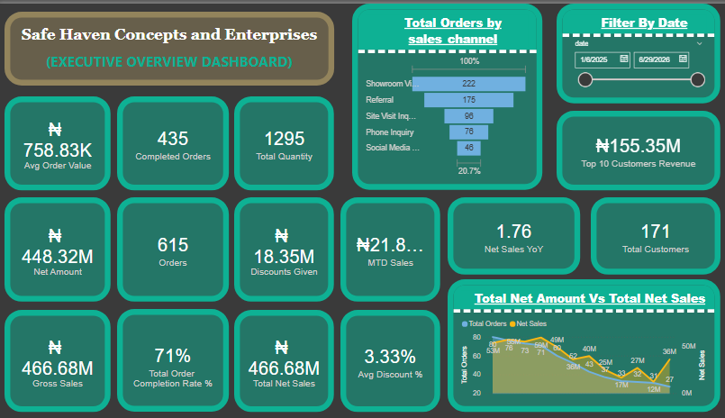
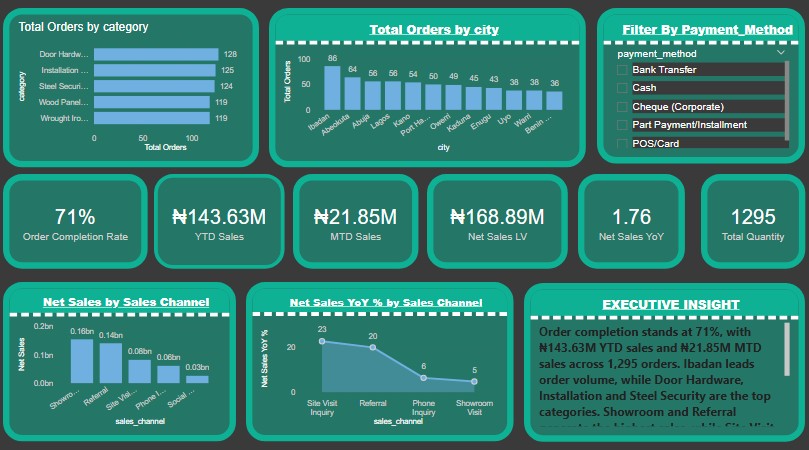
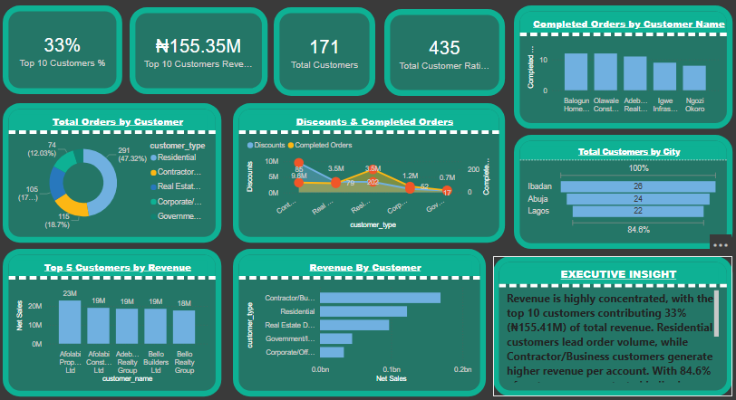
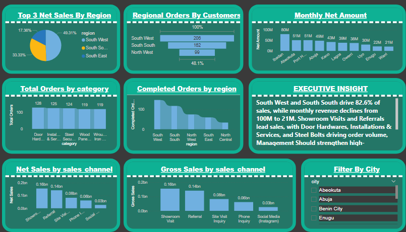
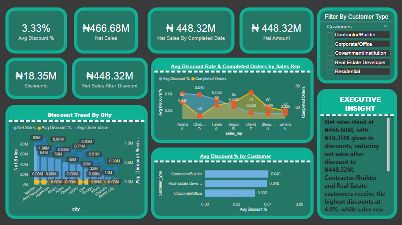
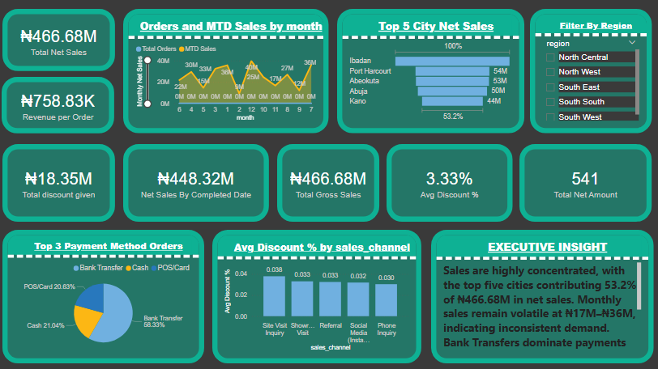

## Power-Bi-Sales-Analytics-portfolio

A portfolio of 6 interactive Power BI dashboards built to analyze sales performance, customer behavior, margin health, and operational efficiency for Safe Haven. 
Built with DAX, Power Query, and executive-level storytelling to drive data-driven decisions.

## 📊 Dashboards Included

### 1. **Executive Overview Dashboard**

**Purpose**: C-Suite overview of business health 
**Key Metrics**: ₦466.68M Net Sales, Top 5 Cities = 53.2% of revenue 
**Insights**: Revenue concentration, sales volatility, payment methods

### 2. **Operations and Order Health Dashboard**

**Purpose**: Track fulfillment and operational efficiency 
**Key Metrics**: 71% Order Completion Rate, ₦143.63M YTD Sales 
**Insights**: Top cities, top categories, channel growth YoY

### 3. **Customer Deep Dive Dashboard**

**Purpose**: Understand customer segmentation and value 
**Key Metrics**: 171 Total Customers, Top 10 = 33% of revenue ₦155.41M 
**Insights**: Residential vs Contractor value, geographic concentration

### 4. **Regional Dashboard**

**Purpose**: Geographic performance and market concentration 
**Key Metrics**: Top 5 Cities drive 53.2% of revenue
**Insights**: Revenue by city, expansion opportunities

### 5. **Discounts and Margins Dashboard**

**Purpose**: Analyze pricing strategy and profitability 
**Key Metrics**: 3.33% Avg Discount ₦18.35M, ₦448.32M Net After Discount 
**Insights**: Discount by customer type, sales rep, and city

### 6. **Finance Analysis Dashboard**

**Purpose**: Revenue trends and channel performance 
**Key Metrics**: Net Sales trend, Showroom ₦0.18bn, Referrals ₦0.14bn 
**Insights**: Declining monthly trend, top product categories

## 🛠 Tools & Skills Used
- **Power BI**: DAX, Power Query, Data Modeling, Visual Design
- **Business Analysis**: KPI tracking, segmentation, trend analysis, margin analysis
